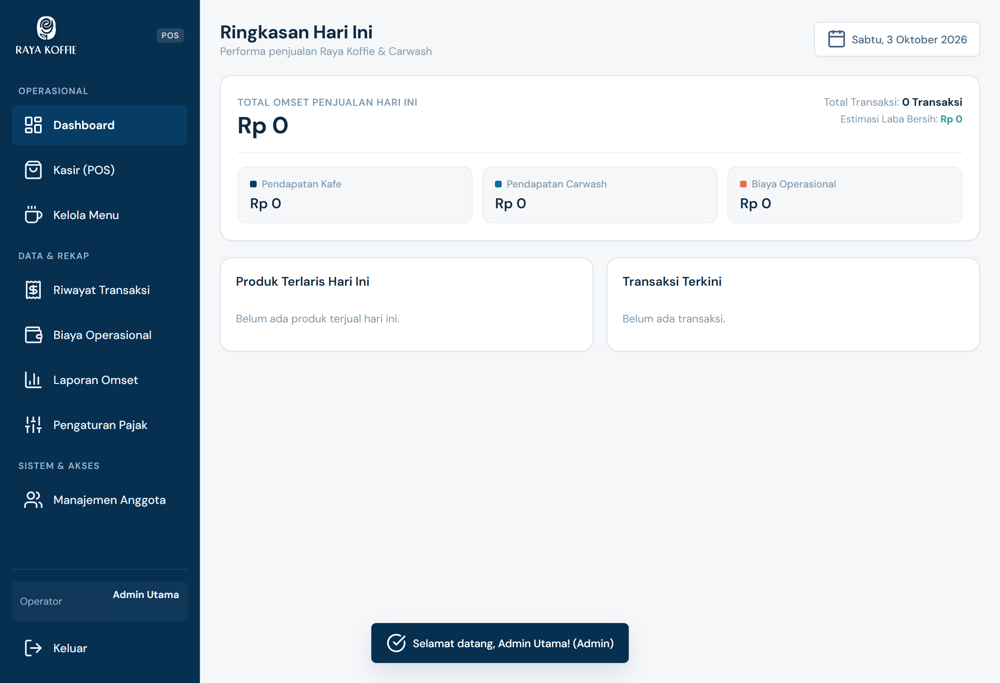
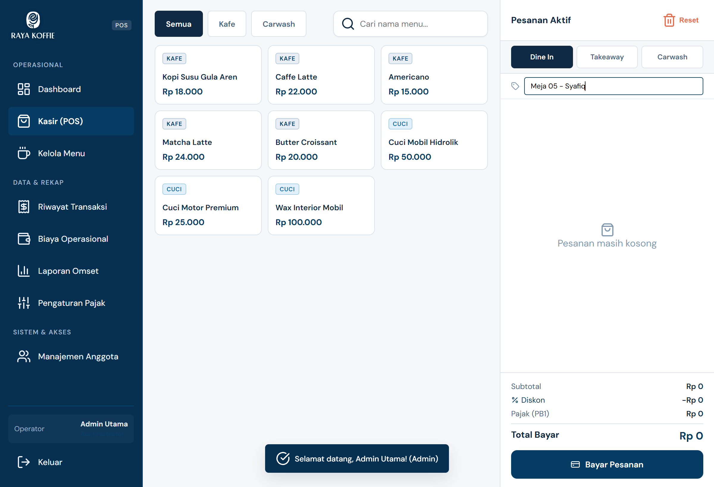
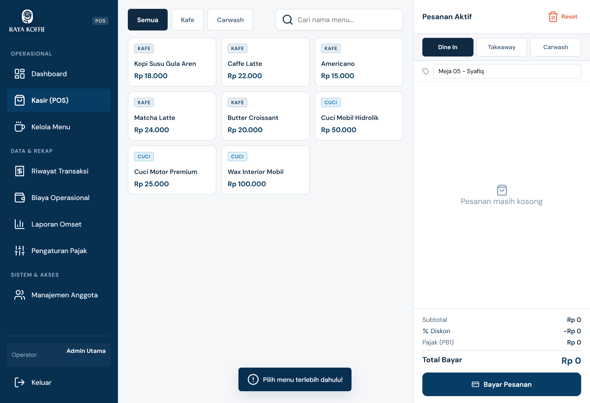
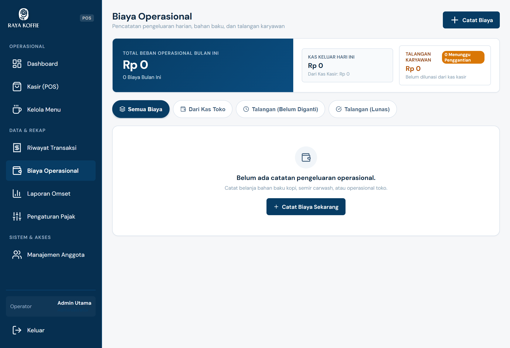
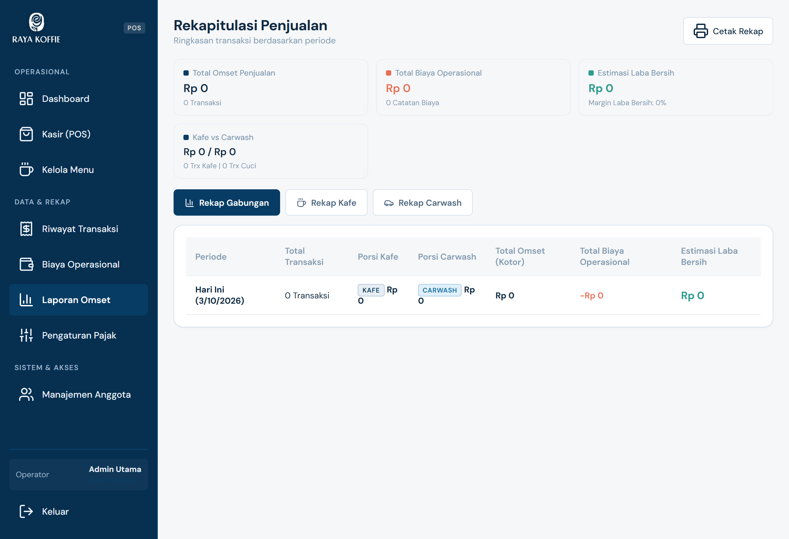

<p align="center">
  
</p>

<h1 align="center">POS Raya Koffie & 439 Carwash</h1>

<p align="center">
  Aplikasi Point of Sale (Kasir) dan Manajemen Operasional hybrid berbasis web serta tablet Android dengan konsep <strong>100% Offline-First</strong>. Dirancang khusus untuk operasional harian terintegrasi antara kedai kopi (Raya Koffie) dan jasa cuci kendaraan (439 Carwash).
</p>

<p align="center">
  
  
  
  
  
</p>

---

## Daftar Isi
- [Gambaran Umum](#gambaran-umum)
- [Tangkapan Layar](#tangkapan-layar)
- [Fitur Utama](#fitur-utama)
- [Kredensial Akun Awal](#kredensial-akun-awal)
- [Teknologi yang Digunakan](#teknologi-yang-digunakan)
- [Struktur Direktori](#struktur-direktori)
- [Panduan Instalasi & Menjalankan](#panduan-instalasi--menjalankan)
- [Build APK Android](#build-apk-android)
- [Dokumentasi Lengkap](#dokumentasi-lengkap)

---

## Gambaran Umum

Aplikasi POS Raya Koffie & 439 Carwash dirancang untuk mengatasi kebutuhan kasir gabungan dalam satu antarmuka yang cepat dan ramah layar sentuh. Sistem bekerja penuh secara luring (tanpa ketergantungan koneksi internet dan cloud), menjaga privasi data, serta mengeliminasi resiko gangguan operasional akibat jaringan terputus.

Aplikasi mendukung pencetakan nota langsung ke printer thermal Bluetooth (ESC/POS 58mm/80mm), ekspor laporan rekapitulasi penjualan berformat PDF resmi langsung ke penyimpanan perangkat internal, dan pembagian hak akses bertingkat antara Administrator dan Kasir.

---

## Tangkapan Layar

| Dashboard Ringkasan Keuangan | Kasir POS Kafe & Carwash |
| :---: | :---: |
|  |  |

| Modal Pembayaran & Kembalian | Cetak Struk Transaksi |
| :---: | :---: |
|  |  |

| Pencatatan Biaya Operasional | Laporan & Ekspor Omzet |
| :---: | :---: |
|  |  |

---

## Fitur Utama

### 1. Transaksi Penjualan Multi-Kategori
- Pemisahan kategori pesanan antara **Kafe** (makanan & minuman) dan **Carwash** (layanan cuci kendaraan).
- Keranjang belanja interaktif dengan opsi kuantitas cepat dan input catatan per item.
- Kalkulasi otomatis subtotal, diskon (nominal atau persentase), dan pajak restoran (PB1).
- Pilihan metode pembayaran: Tunai (dengan kalkulator kembalian dan tombol nominal pas/cepat), QRIS, dan Transfer Bank.

### 2. Integrasi Printer Thermal Bluetooth (ESC/POS)
- Terhubung langsung ke printer thermal Bluetooth 58mm atau 80mm via Web Bluetooth API.
- Format cetak struk profesional dengan logo kedai, nomor nota, detail pesanan, rincian pembayaran, dan ucapan terima kasih.
- Opsi fallback cetak menggunakan protokol Android Intent (RawBT) atau dialog cetak bawaan sistem.

### 3. Dashboard Pemantauan Real-Time
- Statistik ringkas omzet harian dengan pemisahan pendapatan Kafe vs Carwash.
- Pelacakan total pengeluaran kas operasional dan kalkulasi laba bersih harian.
- Daftar 5 produk dan layanan dengan penjualan tertinggi (Top 5 Best Seller).

### 4. Pengeluaran Operasional & Talangan Karyawan
- Pencatatan pengeluaran kas harian dengan kategori jelas (bahan baku, perlengkapan cuci, operasional, dll.).
- Dukungan pelacakan sumber dana kasir maupun talangan pribadi staf/karyawan.
- Manajemen status penggantian dana (Reimbursement) untuk memastikan pembukuan kas tetap seimbang.

### 5. Manajemen Produk & Layanan
- Tambah, ubah, dan nonaktifkan menu kafe atau paket cuci tanpa menghapus data historis transaksi (soft-delete).
- Pengaturan harga satuan dan pengelompokan kategori.
- Dukungan upload gambar produk lokal.

### 6. Kontrol Akses Berbasis Peran (RBAC)
- **Administrator**: Akses penuh ke seluruh menu (Dashboard analitik, kelola produk, koreksi riwayat, biaya operasional, manajemen anggota tim, dan ekspor laporan omzet).
- **Kasir**: Antarmuka terfokus untuk input transaksi penjualan, cetak struk, dan input pengeluaran kasir harian.
- Keamanan berbasis proteksi PIN dengan opsi tampil/sembunyi di antarmuka administrasi.

### 7. Ekspor Laporan Offline Langsung ke Tablet
- Pembuatan laporan omzet berformat PDF resmi menggunakan engine jsPDF + jsPDF-AutoTable.
- Penyimpanan dokumen langsung ke direktori memori internal tablet Android (`Documents/RayaKoffie/`) via `@capacitor/filesystem`.
- Format unduhan berkas juga kompatibel dengan mode browser biasa.

---

## Kredensial Akun Awal

Sistem menyediakan akun awal bawaan untuk mempermudah pengujian dan implementasi pertama:

| Peran (Role) | Username | Password / PIN | Cakupan Hak Akses |
| :--- | :--- | :--- | :--- |
| **Admin Utama** | `admin` | `admin` | Seluruh fitur sistem dan pengaturan data |
| **Kasir** | `kasir` | `kasir` | Transaksi kasir, cetak nota, dan input biaya |

> Informasi keamanan: Kredensial dan PIN pengguna dapat diubah kapan saja melalui menu **Manajemen Anggota** oleh Administrator.

---

## Teknologi yang Digunakan

- **Frontend Core**: HTML5 Semantic, Modern Vanilla CSS3 (desain responsif ramah layar sentuh tablet), JavaScript ES6+ Modules.
- **Build Tool & Dev Server**: [Vite 8](https://vite.dev/) untuk proses kompilasi cepat dan modular.
- **Android Runtime**: [Capacitor 8](https://capacitorjs.com/) sebagai jembatan native WebView pada perangkat Android.
- **Thermal Printing Engine**: Web Bluetooth API dengan ESC/POS Command Byte Encoder kustom (`thermal-printer.js`).
- **File System Bridge**: `@capacitor/filesystem` untuk manajemen berkas lokal pada direktori internal Android.
- **Dokumen Generator**: `jspdf` dan `jspdf-autotable` untuk pembuatan dokumen rekapitulasi penjualan.
- **Penyimpanan Data**: `localStorage` terstruktur dengan skema koleksi JSON mandiri tanpa server luar.

---

## Struktur Direktori

```text
Projek kasir rayya coffe/
├── android/                         # Proyek native Android (Capacitor wrapper & Gradle)
│   ├── app/                         # Kode sumber aplikasi native, manifest, & ikon
│   ├── gradlew / gradlew.bat        # Skrip build Gradle
│   └── build.gradle                 # Konfigurasi level build Android
├── docs/                            # Dokumentasi resmi dan aset panduan operasional
│   ├── Buku_Panduan_Penggunaan_POS_Raya_Koffie.pdf   # Buku panduan lengkap siap cetak
│   ├── Buku_Panduan_Penggunaan_POS_Raya_Koffie.html  # Buku panduan versi interaktif
│   ├── guide-assets/                # Aset gambar tangkapan layar antarmuka
│   ├── arsitektur.md                # Spesifikasi teknis arsitektur sistem
│   ├── fitur_detail.md              # Logika bisnis dan rumus perhitungan
│   ├── desain.md                    # Panduan desain warna dan tipografi
│   └── ui.md                        # Panduan tata letak antarmuka
├── public/                          # Aset statis web (ikon, favicon, logo)
├── index.html                       # Berkas entri antarmuka tunggal (SPA)
├── main.js                          # Logika aplikasi, state, cart, kalkulasi, & UI
├── style.css                        # Aturan gaya visual, tema kasir, & layout tablet
├── thermal-printer.js               # Driver komunikasi printer Bluetooth ESC/POS
├── local-file-saver.js              # Modul penyimpanan berkas offline perangkat
├── logo-data.js                     # Enkoding Base64 aset logo untuk struk & laporan
├── capacitor.config.json            # Konfigurasi bundle ID dan runtime Capacitor
├── package.json                     # Konfigurasi dependensi dan skrip proyek
└── Raya_Koffie_POS_v2.0.apk         # Berkas instalasi APK Android siap pakai
```

---

## Panduan Instalasi & Menjalankan

### Prasyarat Sistem
- **Node.js**: Versi 18.0.0 atau yang lebih baru.
- **NPM**: Versi 9.0.0 atau yang lebih baru.
- **Java Development Kit (JDK)**: Versi 17 (dibutuhkan jika ingin melakukan kompilasi APK Android dari sumber).
- **Android Studio & SDK**: Dibutuhkan untuk build native Android atau debugging via emulator/perangkat fisik.

### Langkah Instalasi
1. Clone repositori ke komputer lokal Anda:
   ```bash
   git clone https://github.com/SyafiqSiregar/Rayya-Coffe.git
   cd Rayya-Coffe
   ```

2. Pasang seluruh dependensi proyek:
   ```bash
   npm install
   ```

3. Jalankan server pengembangan lokal:
   ```bash
   npm run dev
   ```
   Buka alamat yang tertera di terminal (contoh: `http://localhost:5173/`) pada peramban web Anda.

---

## Build APK Android

Proyek ini telah dikonfigurasi dengan skrip otomasi satu langkah untuk mempermudah pembuatan berkas installer APK:

1. **Build APK Otomatis (1 Perintah)**:
   ```bash
   npm run build:apk
   ```
   Perintah ini akan secara otomatis:
   - Menjalankan build bundle web via Vite (`npm run build`).
   - Menyinkronkan aset web ke direktori Android Capacitor (`npx cap sync android`).
   - Mengompilasi berkas APK mode debug menggunakan Gradle Wrapper.

2. **Membuka Proyek di Android Studio**:
   Jika Anda ingin menguji langsung ke tablet kasir atau membuat build rilis tertandatangani (signed release APK):
   ```bash
   npm run cap:open
   ```

3. **APK Siap Pakai**:
   Berkas APK versi siap pasang telah disediakan langsung pada repositori dengan nama berkas:
   ```text
   Raya_Koffie_POS_v2.0.apk
   ```

---

## Dokumentasi Lengkap

Untuk panduan operasional kasir dan rincian arsitektur sistem, Anda dapat membaca berkas yang tersedia di folder `docs/`:

- [Buku Panduan Penggunaan Kasir & Admin (HTML)](docs/Buku_Panduan_Penggunaan_POS_Raya_Koffie.html)
- [Buku Panduan Siap Cetak (PDF)](docs/Buku_Panduan_Penggunaan_POS_Raya_Koffie.pdf)
- [Spesifikasi Teknis & Arsitektur](docs/arsitektur.md)
- [Rincian Logika Bisnis & Perhitungan](docs/fitur_detail.md)
- [Pedoman Desain Visual](docs/desain.md)
- [Dokumentasi Antarmuka & Layar Tablet](docs/ui.md)

---

## Lisensi & Hak Cipta

Dikembangkan untuk operasional **Raya Koffie & 439 Carwash**, Daya Asri, Tulang Bawang Barat (Tubaba), Lampung.  
Hak Cipta dilindungi undang-undang.
