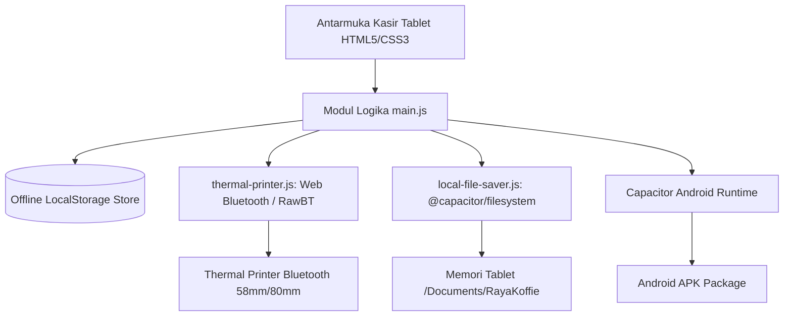
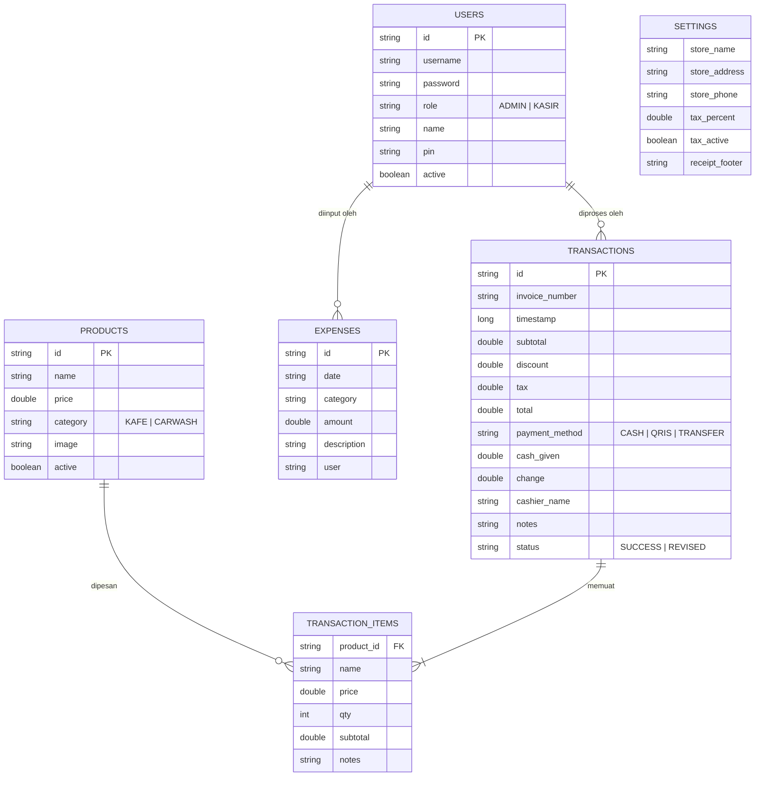

# System Architecture & Technical Specifications
**Aplikasi POS Raya Koffie & 439 Carwash (Capacitor Hybrid)**

Dokumen ini menjelaskan arsitektur sistem, struktur data, integrasi perangkat keras, dan struktur proyek resmi aplikasi POS Raya Koffie & 439 Carwash berbasis **Capacitor + Web**.

---

## 1. Arsitektur Aplikasi (Architecture Overview)

Aplikasi POS ini dirancang dengan prinsip **100% Offline-First**, cepat, dan responsif untuk penggunaan pada perangkat **Tablet Android** (layar sentuh kasir) serta kompatibel dengan browser desktop:

- **Core Framework & Runtime:** [Capacitor 8](https://capacitorjs.com/) (Android WebView Bridge)
- **Build Tool:** Vite (Ultra-fast ES modules & production bundling)
- **Frontend UI & Logic:** HTML5 Semantic + Modern Vanilla CSS3 + JavaScript (ES6+ Modules)
- **Penyimpanan Data Lokal:** `localStorage` & Client-Side Structured Store (Offline Persistence tanpa ketergantungan server/cloud)
- **Pencetakan Struk Thermal:** ESC/POS over Bluetooth (Web Bluetooth API) dengan fallback Android Intent RawBT & Window Print
- **Penyimpanan Berkas Laporan:** `@capacitor/filesystem` (Menyimpan PDF/Excel langsung ke direktori penyimpanan tablet internal `Documents/RayaKoffie/`)
- **Ekspor Dokumen:** jsPDF + jsPDF-AutoTable untuk cetak & ekspor PDF laporan omzet



---

## 2. Struktur Data & Skema Penyimpanan Lokal (Data Schema)

Semua data tersimpan secara mandiri dalam format JSON di penyimpanan lokal tablet.



---

## 3. Detail Penyimpanan Koleksi Data

### A. Koleksi `pos_users`
Menyimpan kredensial dan hak akses pengguna.
| Field | Tipe | Keterangan |
|---|---|---|
| `id` | String | Identifier unik user |
| `username` | String | Nama pengguna untuk login |
| `password` | String | Kata sandi login |
| `role` | String | Hak akses: `ADMIN` atau `KASIR` |
| `name` | String | Nama lengkap kasir/staf |
| `pin` | String | PIN cepat kasir (dapat di-toggle tampil/sembunyi) |
| `active` | Boolean | Status aktif/nonaktif |

### B. Koleksi `pos_products`
Menyimpan menu kafe dan layanan cuci mobil/motor.
| Field | Tipe | Keterangan |
|---|---|---|
| `id` | String | Identifier unik produk |
| `name` | String | Nama item |
| `price` | Number | Harga satuan dalam Rupiah |
| `category` | String | `KAFE` atau `CARWASH` |
| `image` | String (Optional) | Base64 gambar atau ikon default |
| `active` | Boolean | Status ketersediaan menu |

### C. Koleksi `pos_transactions`
Menyimpan riwayat transaksi penjualan kasir.
| Field | Tipe | Keterangan |
|---|---|---|
| `id` | String | Identifier transaksi |
| `invoice_number` | String | Nomor nota struk (format: `INV/YYYYMMDD/...`) |
| `timestamp` | Number | Waktu transaksi dibuat (epoch millis) |
| `items` | Array | Daftar item yang dibeli (nama, qty, harga, subtotal) |
| `subtotal` | Number | Total belanja sebelum pajak & diskon |
| `discount` | Number | Potongan harga |
| `tax` | Number | Nominal pajak (PB1/PPN) |
| `total` | Number | Grand total yang dibayar |
| `payment_method` | String | `CASH`, `QRIS`, atau `TRANSFER` |
| `cash_given` | Number | Nominal uang tunai diterima |
| `change` | Number | Uang kembalian |
| `cashier_name` | String | Kasir bertugas |
| `status` | String | Status transaksi (`SUCCESS` / `REVISED`) |

### D. Koleksi `pos_expenses`
Menyimpan pencatatan pengeluaran kas operasional.
| Field | Tipe | Keterangan |
|---|---|---|
| `id` | String | Identifier pengeluaran |
| `date` | String | Tanggal pengeluaran (format `YYYY-MM-DD`) |
| `category` | String | Kategori (Bahan Baku, Listrik, Operasional Cuci, dll.) |
| `amount` | Number | Nominal biaya |
| `description` | String | Catatan rinci keperluan biaya |
| `user` | String | Nama staf pembuat entri |

---

## 4. Struktur Direktori Proyek

```
projek-kasir-rayya-coffe/
├── android/                         → Proyek wrapper native Android (Capacitor)
│   ├── app/                         → Kode & manifest Android aplikasi
│   ├── capacitor-cordova-android-plugins/
│   ├── gradlew / gradlew.bat        → Script build Gradle Android
│   └── build.gradle / settings.gradle
├── dist/                            → Hasil build web production dari Vite
├── docs/                            → Dokumentasi teknis & buku panduan resmi
│   ├── Buku_Panduan_Penggunaan_POS_Raya_Koffie.pdf   → Panduan operasional siap cetak
│   ├── Buku_Panduan_Penggunaan_POS_Raya_Koffie.html  → Panduan format web interaktif
│   ├── guide-assets/                → Screenshot panduan resolusi tablet
│   ├── arsitektur.md                → Dokumen arsitektur sistem ini
│   ├── fitur_detail.md              → Rincian logika bisnis & perhitungan
│   ├── desain.md                    → Pedoman desain & warna tema
│   └── ui.md                        → Dokumentasi layout & antarmuka
├── public/                          → Aset statis web
├── capacitor.config.json            → Konfigurasi runtime Capacitor
├── index.html                       → Single Page Application entrypoint
├── main.js                          → Logika utama state, modal, cart, filter & data
├── style.css                        → Styling responsif, animasi, glassmorphism tablet
├── thermal-printer.js               → Modul pencetakan Bluetooth Thermal ESC/POS
├── local-file-saver.js              → Modul penyimpanan dokumen offline tablet
├── logo-data.js                     → Enkoding aset logo untuk struk & PDF
├── generate-guide-pdf.js            → Generator otomatis Buku Panduan PDF
├── capture-guide.js                 → Skrip otomatis penangkap layar panduan
├── package.json                     → Konfigurasi dependensi dan script build
└── Raya_Koffie_POS_v2.0.apk         → File APK Android siap install ke perangkat
```

---

## 5. Perintah Penggunaan & Build

- **Jalankan Mode Pengembangan:**
  ```bash
  npm run dev
  ```
- **Build Web Bundle:**
  ```bash
  npm run build
  ```
- **Sinkronisasi ke Android:**
  ```bash
  npm run cap:sync
  ```
- **Build APK Android Lengkap (1 Perintah):**
  ```bash
  npm run build:apk
  ```
- **Buka Proyek Android di Android Studio:**
  ```bash
  npm run cap:open
  ```
